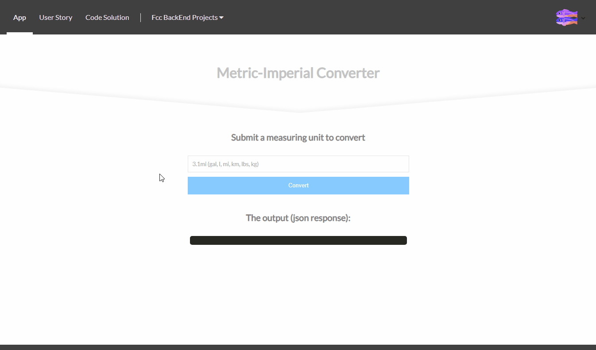

# Metric-Imperial Converter
### About the project

it's a freecodecamp project in the "Information Security and Quality Assurance Projects" module, you have to build a back-end that will receive a measuring unit and return a json response containing the converted unit.

bonus*: 
- Front-end using React, Sass, Responsive Design

### Tools used

**Front-end:** React

**Back-end:** Express, Helmet

**Test:** Mocha, Chai

### Screenshot

### Link

https://fcc-bt-metric-imp-converter.glitch.me

### User stories

1. I will help prevent the client from trying to guess(sniff) the MIME type.
2. I will prevent cross-site scripting (XSS) attacks.
3. I can `GET` `/api/convert` with a single parameter containing an accepted number and unit and have it converted.
4. I can convert `gal` to `L` and vice versa. `(1 gal to 3.78541 L)`.
5. I can convert `lbs` to `kg` and vice versa. `(1 lbs to 0.453592 kg)`.
6. I can convert `mi` to `km` and vice versa. `(1 mi to 1.60934 km)`.
7. If my unit of measurement is invalid, returned will be `invalid unit`.
8. If my number is invalid, returned with will `invalid number`.
9. If both are invalid, return will be `invalid number and unit`.
10. I can use fractions, decimals or both in my parameter(ie. 5, 1/2, 2.5/6), but if nothing is provided it will default to 1.
11. My return will consist of the initNum, initUnit, returnNum, returnUnit, and string spelling out units in format `{initNum} {initial_Units} converts to{returnNum} {return_Units}` with the result rounded to 5 decimals.
12. All 16 unit tests are complete and passing.
13. All 5 functional tests are complete and passing.
